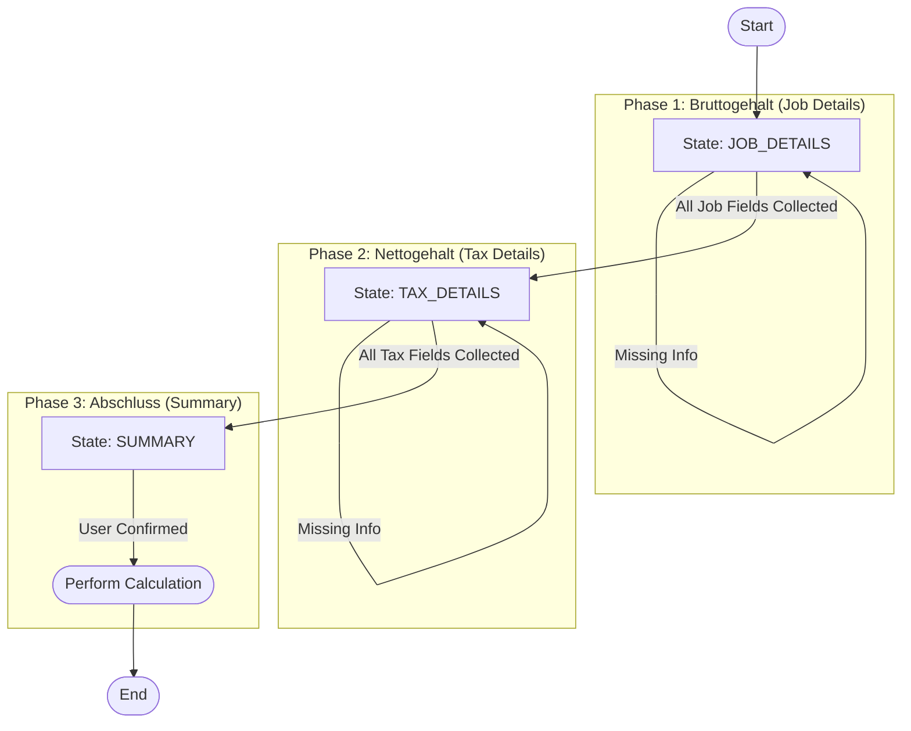

# Salary Chatbot State Machine Documentation

This document describes the Finite State Machine (FSM) architecture used to guide the user through the salary calculation process.

## State Graph



## State Transition Table

| Current State | Condition (Guard) | Next State | Required Fields | Description |
| :--- | :--- | :--- | :--- | :--- |
| **JOB_DETAILS** | `missingFields.length > 0` | **JOB_DETAILS** | `tarif`, `experience`, `hours`, `state` | User is still providing job information. System asks specifically for missing fields. |
| **JOB_DETAILS** | `missingFields.length == 0` | **TAX_DETAILS** | *(Same as above)* | All job details collected. Transition to Tax Details. |
| **TAX_DETAILS** | `missingFields.length > 0` | **TAX_DETAILS** | `taxClass`, `churchTax`, `hasChildren` | User is still providing tax information. |
| **TAX_DETAILS** | `missingFields.length == 0` | **SUMMARY** | *(Same as above)* | All tax details collected. Transition to Summary/Confirmation. |
| **SUMMARY** | `user_confirmed == true` | **COMPLETED** | N/A | User confirms the data. Trigger calculation/saving. |

## Data Context
The state machine maintains a `FormState` object:

```typescript
interface FormState {
  section: 'job_details' | 'tax_details' | 'summary';
  data: {
    job_details: { ... };
    tax_details: { ... };
  };
  missingFields: string[];
}
```
